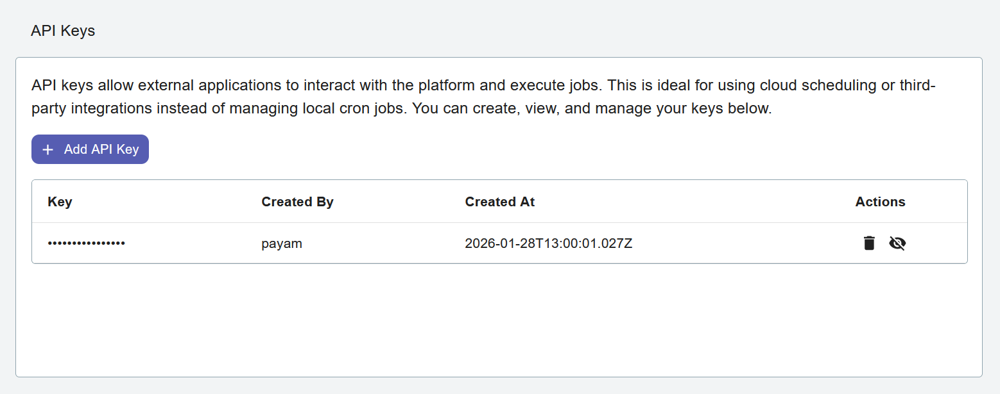

API Keys
========

API Keys provide a secure way to authenticate programmatic access to the Django Email Learning platform. They are designed to enable automated job execution without the need to set up cron jobs directly on the server.
API keys are encrypted in the database using the `ENCRYPTION_SECRET_KEY` defined in your settings. If this key is changed, all existing API keys will become invalid.

Overview
--------

API Keys allow you to:

* Run scheduled jobs programmatically (e.g., ``deliver_contents``)
* Automate content delivery without server-level cron access
* Manage multiple keys for different automation scenarios
* Track which user created each key for audit purposes

This is particularly useful when:

* You don't have direct server access to configure cron jobs
* You want to trigger jobs from external systems or CI/CD pipelines
* You need to integrate Django Email Learning with other automation tools
* You prefer managing scheduled tasks through external job schedulers

Access Requirements
-------------------

Only **Platform Administrators** can create and manage API keys. This includes:

* Platform Admins (members of the "Platform Admin" group)
* Superusers

Creating an API Key
-------------------

1. Navigate to **Settings** → **API Keys** from the platform navigation menu
2. Click the **Add API Key** button
3. The system will generate a secure, random API key

Managing API Keys
-----------------

The API Keys page displays all existing keys with the following information:

* **Key** - A partial view of the API key (for security, only a portion is shown after creation)
* **Created At** - Timestamp when the key was created
* **Created By** - The username of the administrator who created the key
* **Actions** - Delete button to revoke the key
