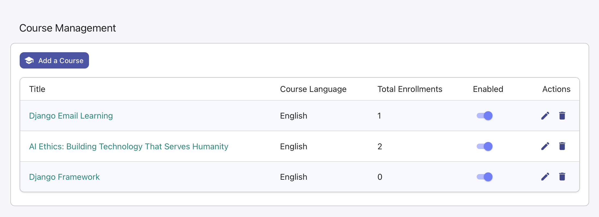
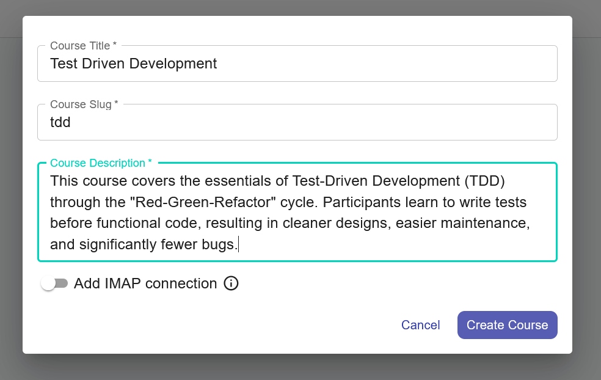
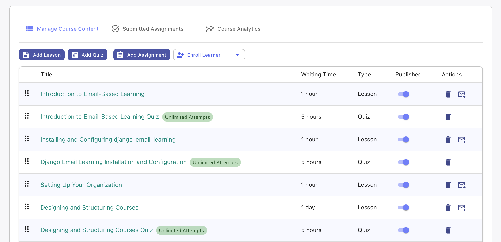
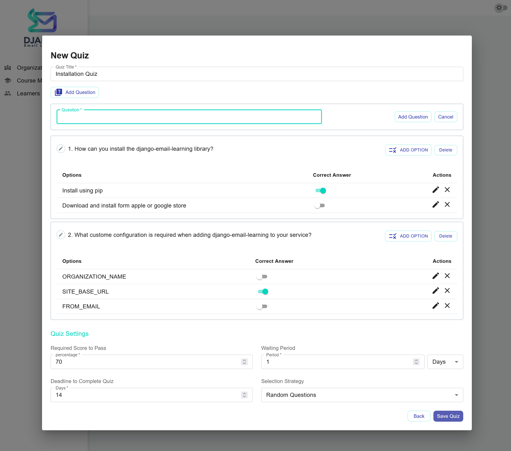

Course Management
=================

The Course Management section is the heart of Django Email Learning, where you create, organize, and manage your educational content. This comprehensive interface allows you to build structured learning experiences that are delivered to learners via email over time.

Overview
--------

The course management page displays all courses within your selected organization. You can switch between organizations using the sidebar if you have access to multiple organizations with appropriate permissions.

Course List Features
~~~~~~~~~~~~~~~~~~~~

The courses table provides an overview of all your courses with the following information:

- **Course Title**: Click to access the course detail page
- **Slug**: URL-friendly identifier used in public enrollment pages
- **Status**: Shows whether the course is enabled (visible for enrollment) or disabled
- **Actions**: Edit, enable/disable, and delete course options

Clicking on any course name navigates to the course detail page where you can manage lessons, quizzes, content ordering, and delivery scheduling.

Creating a New Course
---------------------

To create a new course:

1. Click the **"Add Course"** button at the top of the courses list
2. Fill out the course creation form with the required information
3. Save to create your course foundation

Course Fields
~~~~~~~~~~~~~

**Title** (Required)
  The display name of your course. This appears to learners in enrollment pages and email communications.

**Description** (Required)
  A comprehensive overview of what the course covers, learning objectives, and what learners can expect. This description is shown on public enrollment pages.

**Slug** (Required)
  A URL-friendly identifier that must be unique within your organization. This is used in enrollment URLs and should be descriptive but concise (e.g., "intro-python-programming").

**IMAP Connection** (Optional)
  If you want your learners to be able to interact with the course via email, you can set up an IMAP connection.
  This allows learners to enroll or unsubscribe from the course via email without visiting the platform.

Course Status Management
------------------------

Courses have two states that control their visibility and enrollment availability:

**Enabled Courses**
  - Visible on public organization pages
  - Allow new learner enrollments
  - Continue delivering content to existing enrollments

**Disabled Courses**
  - Hidden from public enrollment pages
  - Block new enrollments
  - Will continue serving existing enrollments

Use the toggle switch in the courses table to quickly enable or disable courses as needed.

Managing Course Content
-----------------------

Once your course is created, navigate to the course detail page to build your learning experience with lessons and quizzes.

Content Types
~~~~~~~~~~~~~

**Lessons**
  Educational content delivered via email, including text, instructions, exercises, and learning materials.

**Quizzes**
  Interactive assessments that test learner comprehension and progress, with automatic scoring and progress tracking.

Content Management Actions
~~~~~~~~~~~~~~~~~~~~~~~~~~

**Adding Content**
  - Click **"Add Lesson"** to create educational content
  - Click **"Add Quiz"** to create assessments
  - Each piece of content can be scheduled for delayed delivery

**Organizing Content**
  - Use drag-and-drop interface to reorder content
  - Content order determines delivery sequence
  - Consider learning progression and difficulty curve

**Scheduling Delivery**
  - Set delays (in days) between content pieces
  - Allow time for learner reflection and practice
  - Balance engagement with overwhelming frequency

Creating Lessons
----------------

Lessons form the core educational content of your courses. To create a lesson:

1. Navigate to the course detail page
2. Click **"Add Lesson"**
3. Configure lesson properties and content

Lesson Configuration
~~~~~~~~~~~~~~~~~~~~~

**Title**
  Clear, descriptive lesson name that indicates the learning focus

**Content**
  The main educational material delivered to learners. Can include:
  - Text-based instruction and explanations
  - Exercises and practice activities
  - Reading assignments and resources
  - Code examples or case studies

**Delivery Delay**
  Time delay (in days) after the previous content before this lesson is sent. Consider:
  - Learner processing time
  - Content complexity
  - Practice and reflection needs

Creating Quizzes
----------------

Quizzes provide assessment and engagement opportunities within your courses. They help measure learner progress and reinforce key concepts.

Quiz Configuration
~~~~~~~~~~~~~~~~~~

**Basic Settings**

**Title**
  Descriptive name for the quiz that indicates the assessment focus

**Questions and Answers**
  - Add multiple-choice questions with various answer options
  - Select one or more correct answers per question
  - At least one correct answer must be specified for each question
  - Support for multiple correct answers per question

**Delivery Settings**

**Waiting Period**
  Delay time before the quiz is sent to learners:
  - Can be specified in days or hours
  - Consider content absorption time
  - Balance with course pacing

**Assessment Criteria**

**Passing Score**
  Minimum score (percentage) required to pass the quiz:
  - Learners must achieve this score to continue
  - Failed attempts allow retakes (up to 2 total attempts)
  - After 2 failed attempts, enrollment is deactivated

**Selection Strategy**
  Choose how questions are presented to learners:

  **All Questions**
    - Every learner receives the same questions
    - Consistent assessment experience
    - Suitable for standardized learning objectives

  **Random Questions**
    - Different question sets for each learner
    - Reduces cheating opportunities
    - Provides variety in retake attempts
    - **Requirement**: Quiz must have at least 6 questions

**Deadline** (Future Feature)
  Time limit (in days) for quiz completion:
  - Currently not enforced by the platform
  - Reserved for future release functionality
  - Plan your quiz timing accordingly

.. note::
   **Quiz Attempts**: Learners have up to 2 attempts to pass each quiz. If they fail both attempts, their enrollment is automatically deactivated to maintain course quality standards.

.. warning::
   **Random Selection Requirements**: When using random question selection, ensure your course has at least 6 questions to provide sufficient variety for different learners and retake scenarios.
