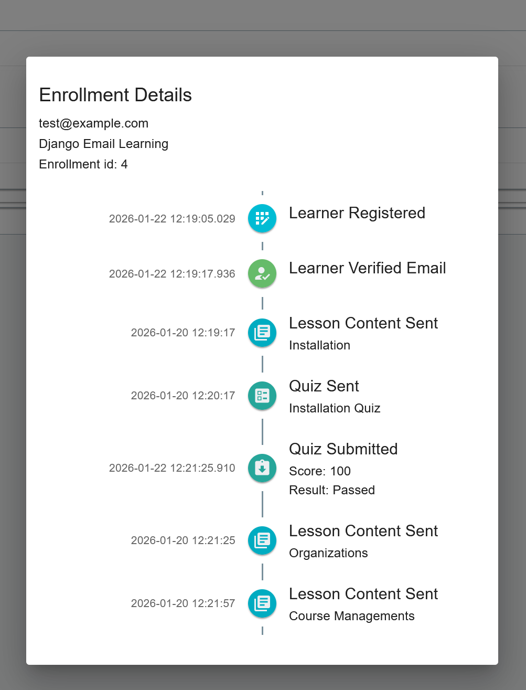

Learner Management
==================

Overview
--------

The learners section is accessible to users with appropriate permissions and allows you to:

- View all learners enrolled in your organization's courses
- Search and filter learners by email
- Monitor individual progress and performance

Learner Discovery
-----------------

**Search Functionality**
  Use the search bar to quickly find learners by email address. This is particularly useful for large organizations with many enrolled learners.

Individual Learner Details
--------------------------

Clicking on any learner's email address opens a detailed view providing comprehensive information about their learning journey.

**Course-Specific Progress**
  For each enrolled course, you can access:
  - **Content Progress**: Which lessons have been delivered and viewed
  - **Quiz Performance**: Scores, attempts, and completion status
  - **Timeline View**: Chronological learning activity

