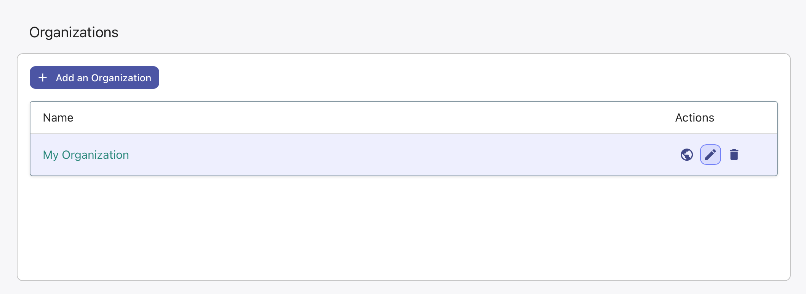
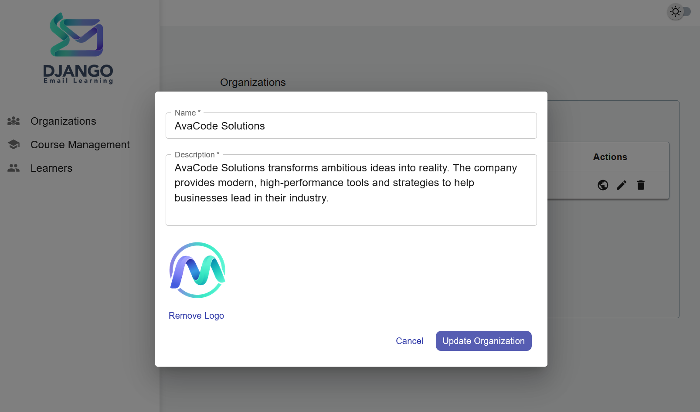

Organizations
=============

Organizations are the top-level containers in Django Email Learning that group courses, learners, and users together. This section provides comprehensive management of organizational structures within your learning platform.

Overview
--------

The Organizations section is accessible via the platform interface at ``/email-learning/platform/organizations/``. This area allows platform administrators to create and manage different organizations, each with their own isolated set of courses, content, and user permissions.

Use Cases
---------

Organizations are particularly useful for:

**Educational Institutions**
  Create separate organizations for different departments, schools, or campuses, each managing their own curriculum and learners.

**Corporate Training**
  Set up organizations for different business units, subsidiaries, or regional offices, allowing decentralized course management.

**Multi-Tenant Platforms**
  Provide completely isolated learning environments for different clients or customers.

Default Organization
--------------------

When Django Email Learning is first installed, a default organization called "My Organization" is automatically created. This ensures you can immediately start creating courses without additional setup.

You can:
- Rename this default organization to match your needs
- Use it as your primary organization
- Create additional organizations as your platform grows

Creating Organizations
----------------------

To create a new organization:

1. Navigate to the Organizations section
2. Click the "Add Organization" button
3. Fill in the required information:
   - **Name**: The organization's display name
   - **Description**: A detailed description of the organization's purpose
   - **Logo**: Upload a logo image (optional)

.. note::
   Ensure your Django ``MEDIA_ROOT`` and ``MEDIA_URL`` settings are properly configured to handle logo uploads.

Managing Organizations
----------------------

Organization Details
~~~~~~~~~~~~~~~~~~~~

When editing an organization, you can modify:

**Basic Information**
  - Organization name and description
  - Logo image (supported formats: JPG, PNG, GIF)

Organization Actions
~~~~~~~~~~~~~~~~~~~~

Each organization in the table displays three action icons:

.. list-table:: Organization Actions
   :widths: 10 20 70
   :header-rows: 1

   * - Icon
     - Action
     - Description
   * - 🌐 Globe
     - **Public View**
     - Opens the organization's public enrollment page where learners can discover and enroll in available courses. This page is accessible without authentication.
   * - ✏️ Edit
     - **Edit Organization**
     - Opens the organization edit form where you can modify name, description, logo, and other settings.
   * - 🗑️ Delete
     - **Delete Organization**
     - Permanently removes the organization and ALL associated data including courses, learners, enrollments, and content. This action cannot be undone.

.. warning::
   **Deletion is Permanent**: Deleting an organization removes all associated courses, learner data, enrollments, and content. Ensure you have backups before proceeding with deletion.

Organization Users and Roles
----------------------------

Organizations support role-based access control with three permission levels:

**Admin Role**
  - Full access to all organization features
  - Can create, edit, and delete courses
  - Manage learners and enrollments
  - Modify organization settings
  - Assign roles to other users

**Editor Role**
  - Create and modify courses
  - Manage course content and lessons
  - View and manage learner enrollments
  - Cannot modify organization settings or user roles

**Viewer Role**
  - Read-only access to courses and learner data
  - Can view reports and analytics
  - Cannot create or modify any content
  - Cannot access organization settings

Creating Organization Users
~~~~~~~~~~~~~~~~~~~~~~~~~~~
To add a user to an organization:
1. Open the organization details page by clicking its name in the organizations list.
2. You will see the "Organization Users" list, and also a button to add new users.
3. Click the "Add User" button to open the user creation form.
4. Enter the user's email address and select their role (Admin, Editor, Viewer).
5. Click "Add User" to create the user and send them an invitation email with the instruction to set their password.

.. note::
   If the email address already exists in the system, the existing user will be added to the organization with the specified role.

.. important::
   Django email learning uses Django Auth built-in URLs and views for password resets. Ensure that you have configured those URLs and views correctly in your Django project settings.
   please check the official Django documentation for more details: https://docs.djangoproject.com/en/6.0/topics/auth/default/#module-django.contrib.auth.views

Public Organization Pages
-------------------------

Each organization has a public page accessible at:

``/email-learning/public/organization/<organization_id>/``

This page:
- Lists all publicly available courses for the organization
- Allows anonymous users to enroll in courses
- Displays organization branding (name, logo, description)
- Provides course enrollment forms and information
